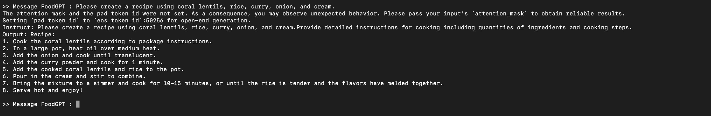

# Custom phi2 use

Custom use of Phi2 model wich is an open source LLM.
We use 2B version.

## Objectives

- POC : use Phi2 model and prove it's sufficient for our use (tips for creating dishes from various ingredients)
- Model quantization for performances improvement
- Offline use with acceptables performances

## Requirements

You need to install right `transformers` version :

```bash
python -m pip install git+https://github.com/huggingface/transformers
```

## Usage

### Launch POC

```bash
python main.py
```

#### Results



### TODO

- [x] First Phi-2 use
- [x] Try custom prompt
- [ ] Improve prompt
- [ ] Offline use
- [ ] Model quantization

## Resources

- [HuggingFace documentation](https://huggingface.co/microsoft/phi-2)
- [LLM courses](https://github.com/mlabonne/llm-course)
